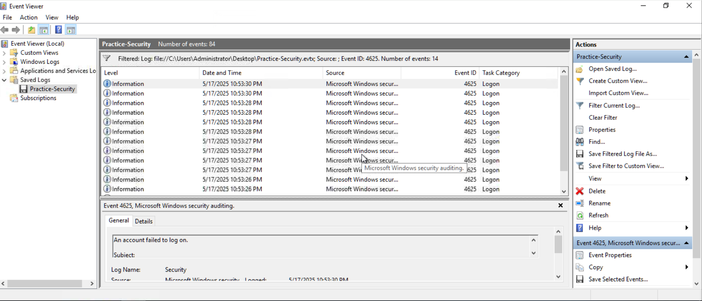
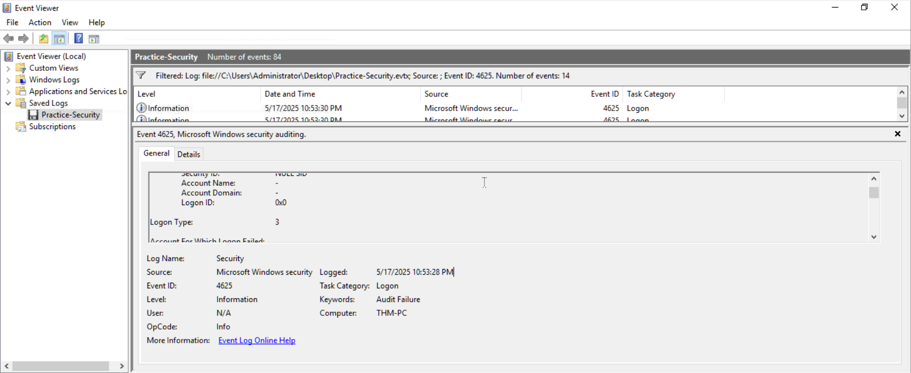
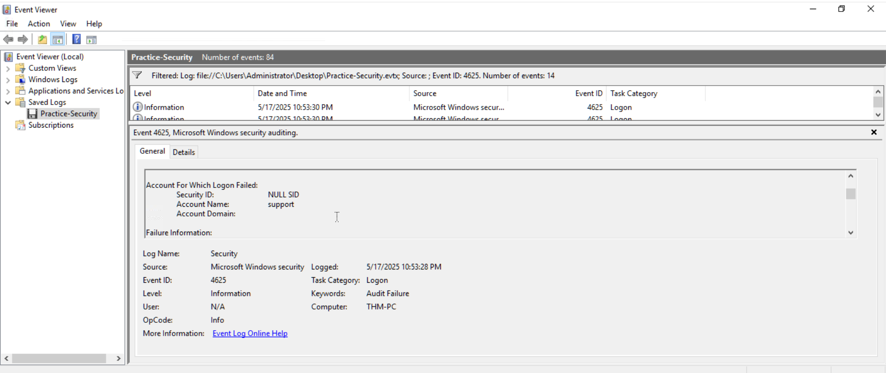
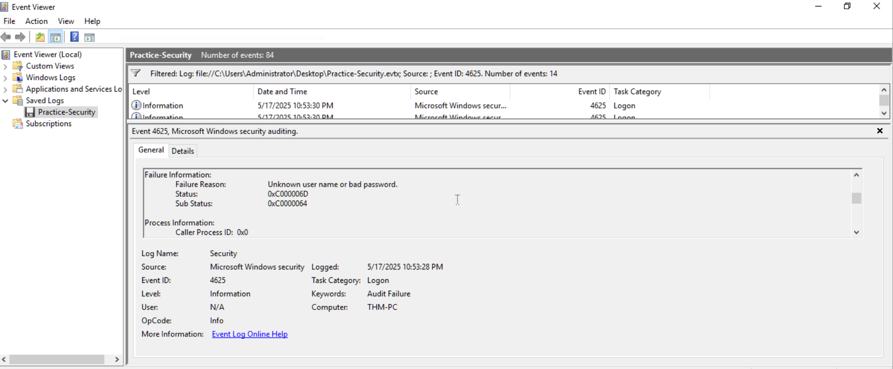
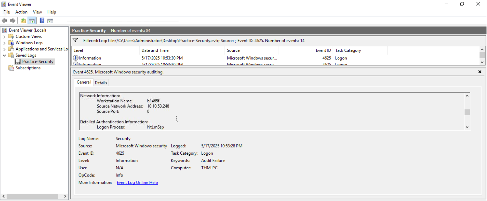
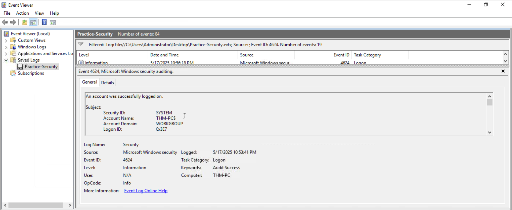
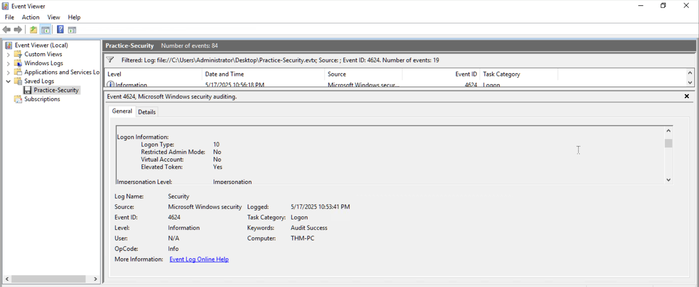
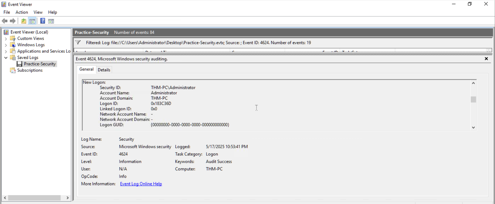
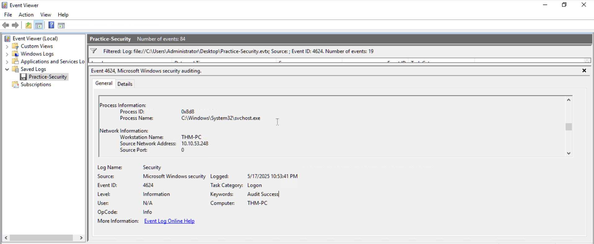
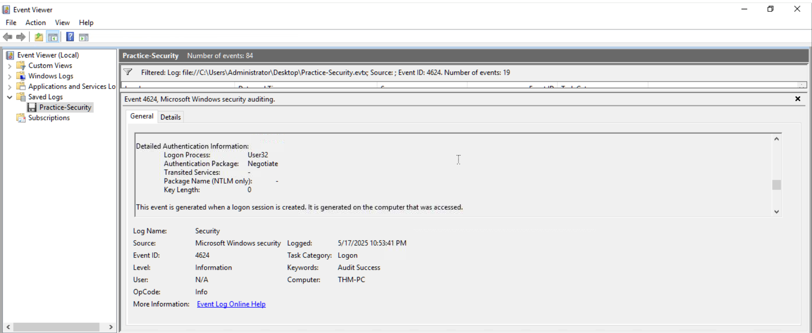

# Case 01 – Windows Brute Force Investigation

## Overview

This investigation analyzes suspicious Windows authentication activity using Windows Security Event Logs.

Multiple failed login attempts were observed from the same source IP address within a short period of time. Shortly afterward, a successful Remote Desktop (RDP) login was recorded from the same source IP.

The objective of this investigation was to determine:

- Which account was targeted
- How many failed authentication attempts occurred
- The source IP address
- The logon type
- The reason for authentication failure
- Whether a successful login followed the failed attempts
- Whether the activity indicates a possible brute-force attack
- What actions a SOC analyst should take

---

## Environment

| Item | Details |
|---|---|
| Platform | TryHackMe |
| System | Windows |
| Log Source | Windows Security Event Log |
| Log File | Practice-Security.evtx |
| Host | THM-PC |
| Investigation Tool | Windows Event Viewer |
| Failed Login Event | Event ID 4625 |
| Successful Login Event | Event ID 4624 |

---

## Investigation Summary

During the investigation, Windows Security logs were filtered for Event ID `4625`, which represents failed authentication attempts.

A total of **14 failed login events** were identified within approximately four seconds.

The failed attempts targeted the account:

`support`

The authentication attempts originated from:

`10.10.53.248`

The failed authentication events used:

`Logon Type 3`

Shortly afterward, a successful Event ID `4624` was identified.

The successful authentication used:

`Logon Type 10`

Logon Type 10 represents a **RemoteInteractive login**, commonly associated with Remote Desktop Protocol (RDP).

The successful login originated from the same source IP:

`10.10.53.248`

The successfully authenticated account was:

`Administrator`

Because multiple failures occurred rapidly from the same IP and were followed shortly afterward by a successful RDP login from the same IP, the activity is highly suspicious and consistent with brute-force or credential-guessing activity followed by successful remote authentication.

---

# Investigation

## 1. Identify Failed Login Events

Windows Event Viewer was used to filter the Security log for:

`Event ID 4625`

Event ID 4625 indicates:

> An account failed to log on.

The filtered results showed **14 failed authentication events**.



### Observation

The failed events occurred between approximately:

`10:53:26 PM – 10:53:30 PM`

The attempts were generated within only a few seconds, which is unusual for normal manual login activity and may indicate automated password guessing.

---

## 2. Failed Login Logon Type

One of the Event ID 4625 records was examined in detail.

The event showed:

`Logon Type: 3`



### Analysis

Windows Logon Type 3 represents a **network logon**.

This means the authentication request originated through the network rather than through a direct interactive login at the machine.

---

## 3. Targeted Account

The Event ID 4625 details showed the following account under:

`Account For Which Logon Failed`

The targeted account was:

`support`



### Finding

The attacker or remote system repeatedly attempted authentication against the `support` account.

---

## 4. Failure Reason

The failed authentication event contained the following information:

- Failure Reason: `Unknown user name or bad password`
- Status: `0xC000006D`
- Sub Status: `0xC0000064`



### Analysis

The authentication attempt failed because Windows could not successfully authenticate the supplied username/password combination.

The rapid repetition of the failures increases the likelihood that automated credential guessing or brute-force activity occurred.

---

## 5. Source IP Address

The Network Information section of the Event ID 4625 record showed:

- Workstation Name: `b1465f`
- Source Network Address: `10.10.53.248`
- Source Port: `0`
- Logon Process: `NtLmSsp`



### Finding

The source IP associated with the failed login attempts was:

`10.10.53.248`

This IP should be considered an important Indicator of Compromise (IOC) for this investigation.

---

# Successful Login Investigation

After identifying the failed attempts, the Security log was searched for:

`Event ID 4624`

Event ID 4624 indicates:

> An account was successfully logged on.

A total of **19 Event ID 4624 records** existed in the log.

Not every successful login is suspicious because Windows generates legitimate authentication events for services, local users, network activity, and system processes.

Therefore, the successful events were reviewed to identify one related to the suspicious authentication activity.



---

## 6. Identify Suspicious Successful Logon Type

A relevant Event ID 4624 entry showed:

`Logon Type: 10`



### Analysis

Windows Logon Type 10 represents:

`RemoteInteractive`

This logon type is typically associated with **Remote Desktop Protocol (RDP)** authentication.

This is particularly important because remote interactive authentication shortly after repeated failures can indicate successful unauthorized remote access.

---

## 7. Successfully Authenticated Account

The `New Logon` section of Event ID 4624 showed:

- Account Name: `Administrator`
- Account Domain: `THM-PC`
- Security ID: `THM-PC\Administrator`



### Finding

The successful authentication was performed using the local:

`Administrator`

account.

This differs from the `support` account observed in the failed attempts.

Therefore, the evidence does not prove that the `support` account itself was successfully brute-forced.

However, a successful Administrator RDP login shortly after the failed authentication activity requires immediate investigation.

---

## 8. Source IP of Successful Login

The Network Information section of the successful Event ID 4624 showed:

- Workstation Name: `THM-PC`
- Source Network Address: `10.10.53.248`
- Source Port: `0`
- Process Name: `C:\Windows\System32\svchost.exe`



### Important Correlation

The failed login attempts originated from:

`10.10.53.248`

The successful RDP authentication also originated from:

`10.10.53.248`

This correlation significantly increases the suspiciousness of the activity.

---

## 9. Authentication Details

Additional authentication information from Event ID 4624 showed:

- Logon Process: `User32`
- Authentication Package: `Negotiate`
- Logon Type: `10`
- Elevated Token: `Yes`



### Analysis

The successful session was a RemoteInteractive login and was associated with an elevated token.

Because the authenticated account was `Administrator`, this session would provide significant privileges on the affected Windows host.

---

# Timeline

| Time | Event | Account | Source IP | Result |
|---|---|---|---|---|
| 10:53:26 PM | Event ID 4625 | support | 10.10.53.248 | Failed |
| 10:53:27 PM | Event ID 4625 | support | 10.10.53.248 | Failed |
| 10:53:28 PM | Event ID 4625 | support | 10.10.53.248 | Failed |
| 10:53:30 PM | Event ID 4625 | support | 10.10.53.248 | Failed |
| 10:53:41 PM | Event ID 4624 | Administrator | 10.10.53.248 | Successful RDP Login |

### Timeline Analysis

Fourteen failed authentication attempts occurred between approximately `10:53:26 PM` and `10:53:30 PM`.

Approximately **11 seconds after the last observed failed attempt**, a successful Event ID 4624 RemoteInteractive login occurred from the same source IP.

The successful authentication used the `Administrator` account.

This sequence is highly suspicious.

---

# Key Findings

| Finding | Value |
|---|---|
| Failed Login Event ID | 4625 |
| Number of Failed Attempts | 14 |
| Failed Login Target | support |
| Failed Login Type | 3 – Network |
| Failure Reason | Unknown user name or bad password |
| Status | 0xC000006D |
| Sub Status | 0xC0000064 |
| Source IP | 10.10.53.248 |
| Source Workstation | b1465f |
| Failed Authentication Process | NtLmSsp |
| Successful Login Event ID | 4624 |
| Successful Account | Administrator |
| Successful Logon Type | 10 – RemoteInteractive |
| Successful Login Source IP | 10.10.53.248 |
| Authentication Package | Negotiate |
| Logon Process | User32 |
| Elevated Token | Yes |
| Affected Host | THM-PC |

---

# Indicators of Compromise / Investigation Indicators

The primary indicator identified during the investigation was:

| Type | Value | Reason |
|---|---|---|
| IP Address | 10.10.53.248 | Generated repeated failed authentication attempts and later successful RDP authentication |

Other relevant investigation indicators include:

- Target account: `support`
- Successfully authenticated account: `Administrator`
- Failed Event ID: `4625`
- Successful Event ID: `4624`
- Network Logon Type: `3`
- RemoteInteractive Logon Type: `10`

---

# Attack Pattern

The observed activity can be represented as:

```text
Source IP: 10.10.53.248
        |
        v
Multiple authentication attempts
        |
        v
14 × Event ID 4625
        |
        v
Target Account: support
        |
        v
Logon Type 3
        |
        v
Authentication failures
        |
        v
Approximately 11 seconds later
        |
        v
Event ID 4624
        |
        v
Account: Administrator
        |
        v
Logon Type 10
        |
        v
Successful RDP authentication
