# Case 02 — Conti Ransomware Investigation

| Case Detail | Information |
|---|---|
| Case ID | `CASE-02` |
| Incident Type | Ransomware |
| Severity | Critical |
| Status | Completed |
| Verdict | True Positive |
| Environment | Authorized TryHackMe lab |
| Analyst | Mounika Padae |

## Executive Summary

This investigation examined a ransomware incident affecting the Microsoft Exchange server `WIN-AOQKG2AS2Q7`. Analysis of Splunk, IIS, Windows Security, and Sysmon telemetry identified evidence consistent with exploitation of an Exchange/OWA endpoint, web-shell activity, PowerShell execution, persistence through a backdoor account, ransomware execution, SMB connections, and ransom-note deployment.

The attacker accessed the server from `10.10.10.2` and interacted with the suspicious OWA file `/owa/auth/i3gfPctK1c2x.aspx`. IIS worker process `w3wp.exe` initiated a PowerShell and command-shell process chain. A local account named `securityninja` was created and enabled, and commands attempted to add it to the local Administrators and Remote Desktop Users groups. The ransomware payload masqueraded as `cmd.exe` in the Administrator's Documents directory and ran as `NT AUTHORITY\SYSTEM`.

The incident resulted in 18 ransom-note creation events across 18 unique locations. Based on the collected evidence, the final verdict is **True Positive — Confirmed Ransomware Compromise**.

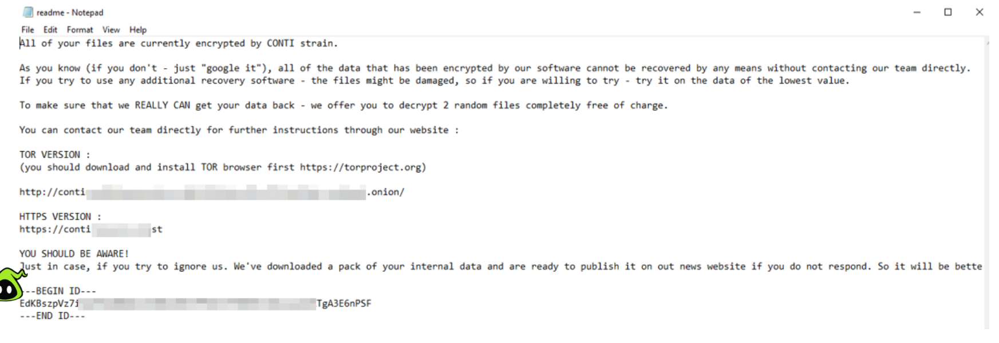

## Investigation Objectives

- Identify the affected host and relevant evidence period.
- Determine the initial-access and execution activity.
- Reconstruct the malicious process chain.
- Identify persistence, command-and-control, and lateral-movement indicators.
- Determine the ransomware payload, hashes, and impact.
- Map confirmed activity to MITRE ATT&CK.
- Recommend containment, eradication, and recovery actions.

## Scope and Evidence Sources

| Item | Value |
|---|---|
| Affected host | `WIN-AOQKG2AS2Q7` |
| Server IP | `10.10.10.6` |
| Suspected attacker IP | `10.10.10.2` |
| Primary incident date | `2021-09-08` |
| Evidence period | `2021-08-28` to `2021-09-08` |
| Total indexed events | `28,145` |
| Data sources | Sysmon, Windows Security/Application logs, IIS logs |
| Analysis platform | Splunk Enterprise 8.2.2 |

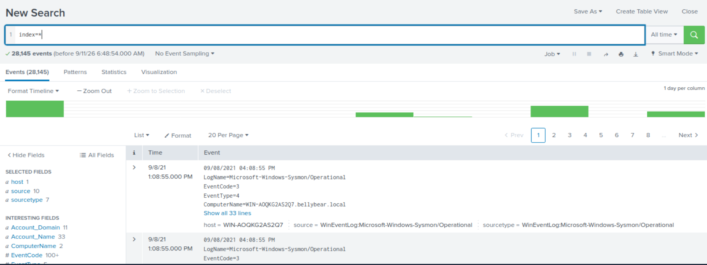

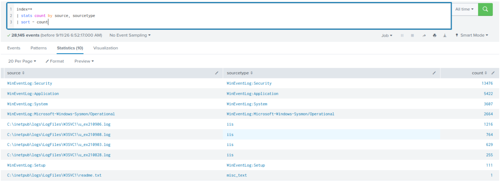

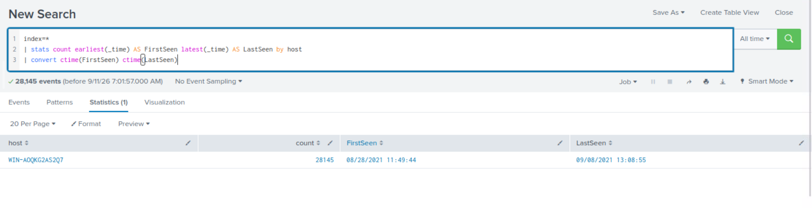

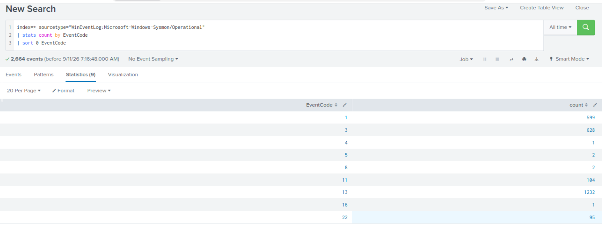

## Key Findings

### 1. Conti ransomware evidence

A ransom note associated with Conti was present in the collected evidence, establishing the ransomware family investigated in this case.

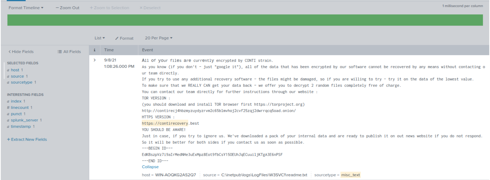

### 2. Suspicious Exchange and OWA activity

IIS logs recorded requests from `10.10.10.2` to the Exchange server at `10.10.10.6`. The requests targeted the suspicious ASPX file:

```text
/owa/auth/i3gfPctK1c2x.aspx
```

The observed OWA and Autodiscover activity is consistent with an Exchange exploitation path and subsequent web-shell interaction. This report describes the activity as **ProxyShell-style** because the available evidence supports the pattern but does not independently prove every vulnerability in the ProxyShell chain.

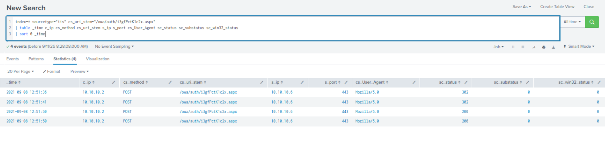

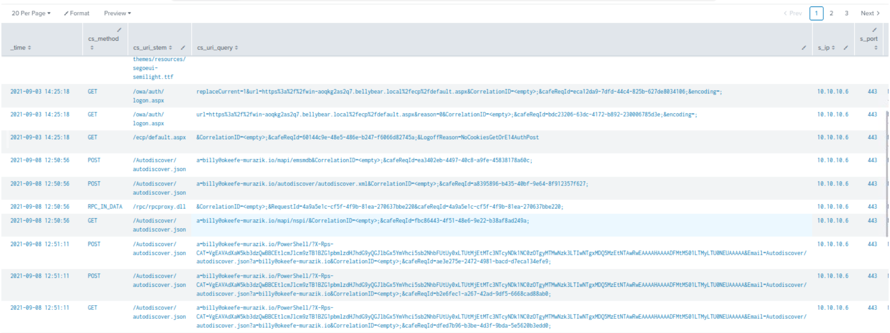

### 3. IIS spawned malicious PowerShell activity

The Exchange IIS worker process `w3wp.exe` spawned PowerShell. The execution included an obfuscated or encoded command, followed by nested PowerShell and `cmd.exe` activity.

Observed process chain:

```text
w3wp.exe
└── powershell.exe (PID 1716)
    └── powershell.exe (PID 15800)
        └── cmd.exe (PID 10116)
```

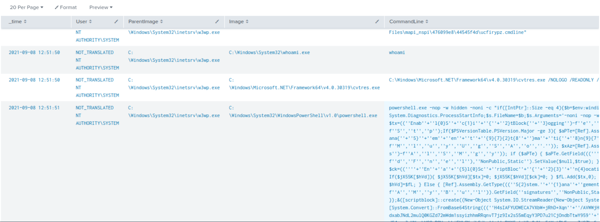

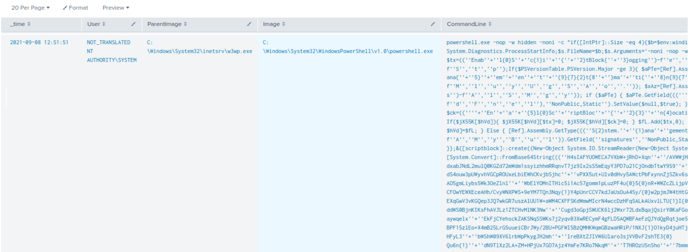

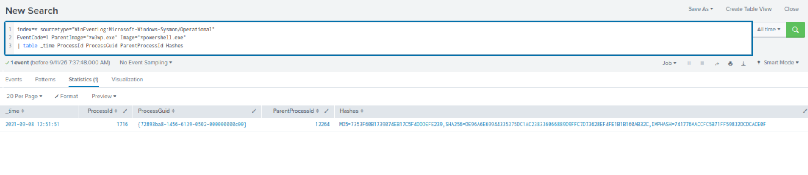

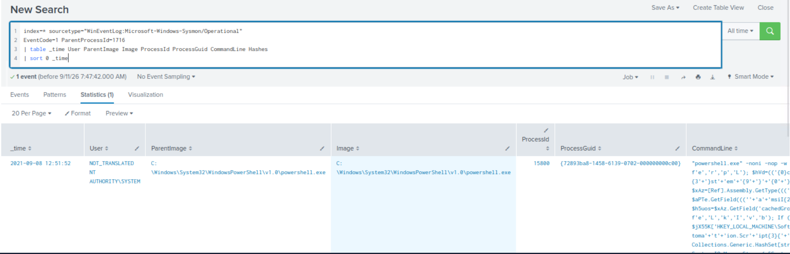

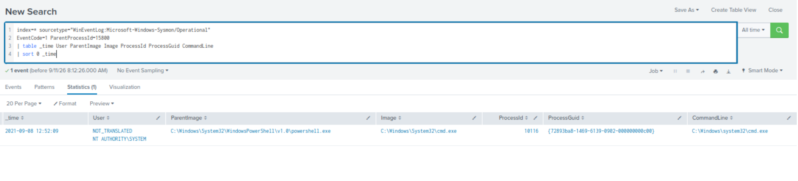

### 4. Command-and-control connection

Sysmon network telemetry showed the malicious PowerShell process communicating with `10.10.10.2` over TCP port `443`. This supports interactive attacker control or command-and-control activity following initial compromise.

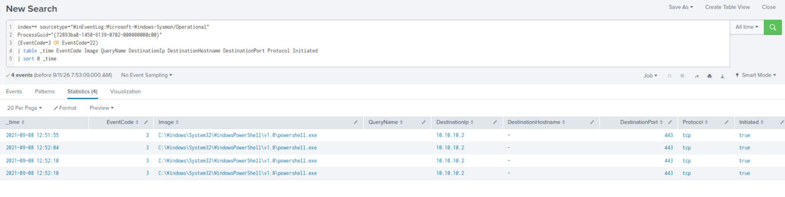

### 5. Web-shell file modification

The command below was used to remove the read-only attribute from the suspicious ASPX file:

```text
attrib.exe -r ...\owa\auth\i3gfPctK1c2x.aspx
```

This provides additional endpoint evidence connecting command execution to the Exchange web shell.

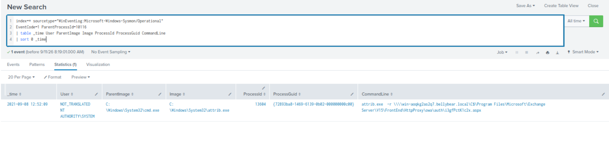

### 6. Backdoor account activity

Commands were executed to create the local account `securityninja` and attempt to add it to privileged groups:

```text
net user securityninja <REDACTED> /add
net localgroup administrators securityninja /add
net localgroup "Remote Desktop Users" securityninja /add
```

Windows Security events confirmed:

- Event ID `4720`: the `securityninja` account was created.
- Event ID `4722`: the account was enabled.
- Event ID `4738`: the account was changed.

No Event ID `4732` evidence was found. Therefore, the commands to add the account to local groups are confirmed, but successful group membership is **not independently verified**.

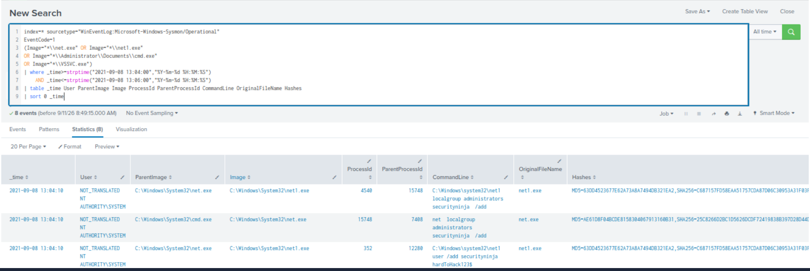

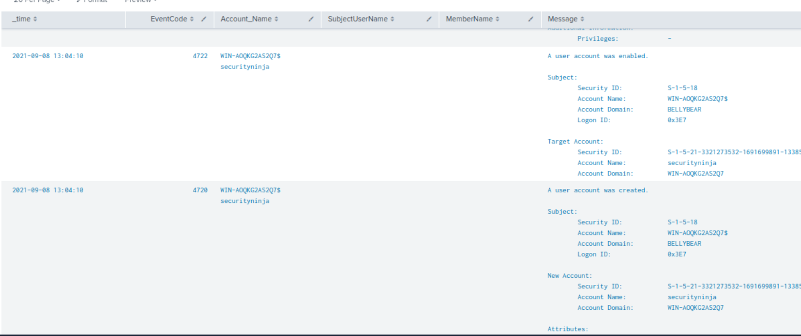

### 7. Ransomware payload discovery and execution

The suspected ransomware binary masqueraded as `cmd.exe` at:

```text
C:\Users\Administrator\Documents\cmd.exe
```

The file was created by `unsecapp.exe` at `12:59:08` and executed at `13:05:32` with `cmd.exe` as its parent. It ran under `NT AUTHORITY\SYSTEM`.

Key process identifiers:

| Field | Value |
|---|---|
| Image | `C:\Users\Administrator\Documents\cmd.exe` |
| Process ID | `15540` |
| Process GUID | `{72893ba8-178c-6139-b402-000000000c00}` |
| Execution account | `NT AUTHORITY\SYSTEM` |
| Execution time | `2021-09-08 13:05:32` |

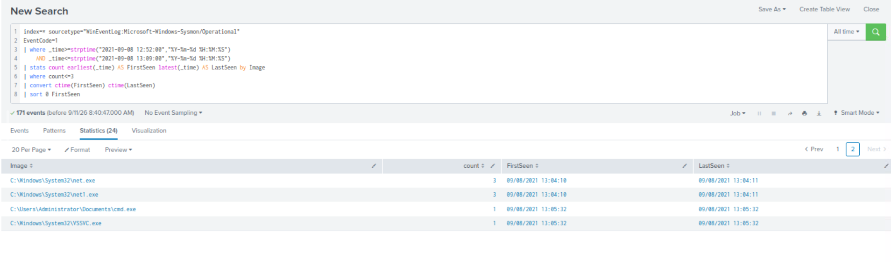

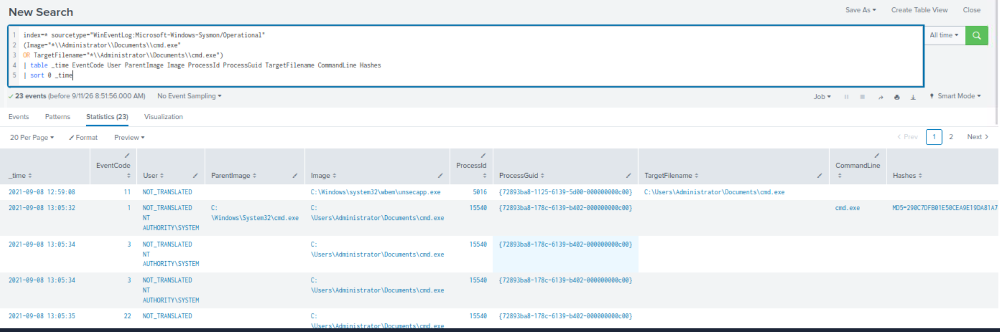

### 8. Payload hashes

| Hash type | Value |
|---|---|
| MD5 | `290C7DFB01E50CEA9E19DA81A781AF2C` |
| SHA-256 | `53B1C1B2F41A7FC300E97D030E57539453FF82001DD3F0ABF07F489DB1F9CA22` |
| IMPHASH | `23F815785DB238377F4513BE540BA574` |

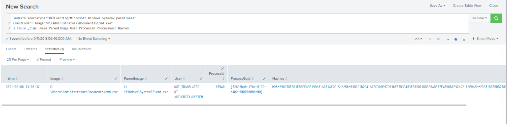

### 9. SMB connections and potential lateral movement

The ransomware process initiated SMB connections over TCP port `445` to:

- `10.10.10.4` — `WIN-FL04EU2YMSM`
- `10.10.10.6` — `WIN-AOQKG2AS2Q7.bellybear.local`

These connections indicate SMB-based discovery or potential propagation. Because the evidence does not show successful execution on `10.10.10.4`, lateral movement to that host is treated as **suspected, not confirmed**.

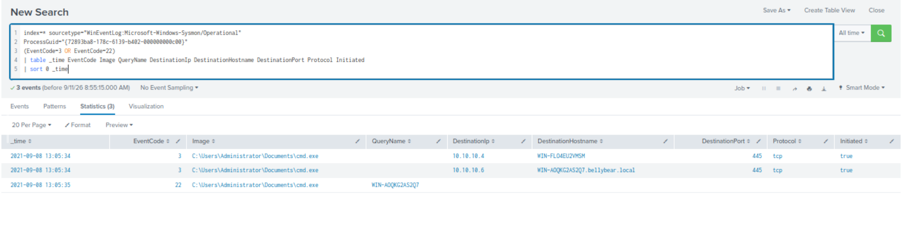

### 10. Ransom-note deployment and impact

Sysmon file-creation events recorded 18 ransom-note events across 18 unique locations.

| Impact measure | Result |
|---|---|
| Ransom-note events | `18` |
| Unique locations | `18` |
| First note | `2021-09-08 13:05:45` |
| Last note | `2021-09-08 13:08:34` |

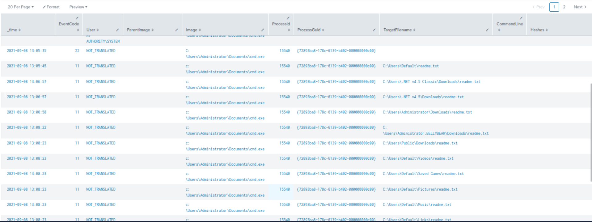

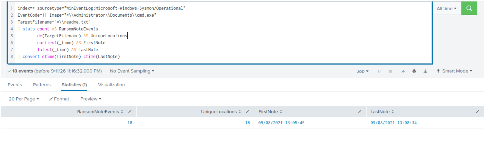

`VSSVC.exe` was observed during the incident. However, no direct command or event proving shadow-copy deletion was identified. Recovery inhibition through shadow-copy deletion is therefore **not confirmed**.

## Attack Timeline

| Time | Activity | Evidence |
|---|---|---|
| `12:50:56–12:51:26` | Suspicious Autodiscover/Exchange requests observed | IIS logs |
| `12:51:36–12:51:50` | Requests made to the OWA ASPX web shell | IIS logs |
| `12:52:09` | `attrib.exe` modified the web-shell file attribute | Sysmon Event ID 1 |
| `12:52:09` | IIS/PowerShell/command-shell execution chain began | Sysmon Event ID 1 |
| `12:59:08` | Masquerading `cmd.exe` payload created by `unsecapp.exe` | Sysmon Event ID 11 |
| `13:04:10–13:04:11` | `securityninja` creation and privileged-group commands executed | Sysmon and Security logs |
| `13:05:32` | Ransomware payload executed as `SYSTEM` | Sysmon Event ID 1 |
| `13:05:34` | Payload initiated SMB connections to `10.10.10.4` and `10.10.10.6` | Sysmon Event ID 3 |
| `13:05:45` | First ransom note created | Sysmon Event ID 11 |
| `13:08:34` | Last observed ransom note created | Sysmon Event ID 11 |

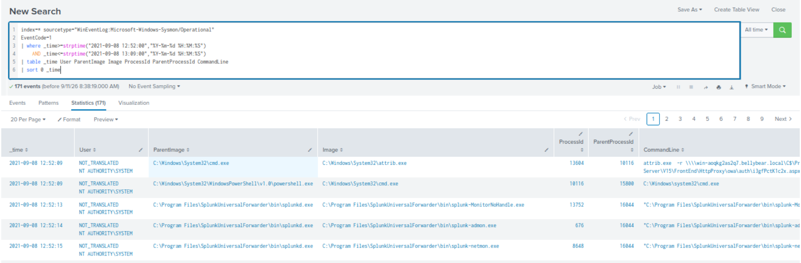

## Indicators of Compromise

### Network indicators

| Indicator | Context |
|---|---|
| `10.10.10.2` | Suspected attacker/C2 source |
| `10.10.10.6` | Compromised Exchange server |
| `10.10.10.4` | SMB connection target |
| TCP `443` | Attacker/web-shell/C2 communication |
| TCP `445` | SMB activity |

### Host indicators

| Indicator | Context |
|---|---|
| `/owa/auth/i3gfPctK1c2x.aspx` | Suspicious Exchange web shell |
| `C:\Users\Administrator\Documents\cmd.exe` | Ransomware payload masquerading as a system utility |
| `securityninja` | Attacker-created backdoor account |
| `{72893ba8-178c-6139-b402-000000000c00}` | Ransomware process GUID |

## MITRE ATT&CK Mapping

| Tactic | Technique | ID | Evidence |
|---|---|---|---|
| Initial Access | Exploit Public-Facing Application | `T1190` | Suspicious Exchange OWA/Autodiscover exploitation activity |
| Persistence | Server Software Component: Web Shell | `T1505.003` | ASPX file under `/owa/auth/` used for web-shell interaction |
| Execution | Command and Scripting Interpreter: PowerShell | `T1059.001` | `w3wp.exe` spawned PowerShell with obfuscated execution |
| Execution | Command and Scripting Interpreter: Windows Command Shell | `T1059.003` | PowerShell spawned `cmd.exe` |
| Defense Evasion | Obfuscated/Compressed Files and Information | `T1027` | Obfuscated or encoded PowerShell command |
| Defense Evasion | Masquerading: Match Legitimate Name or Location | `T1036.005` | Ransomware named `cmd.exe` outside `System32` |
| Persistence | Create Account: Local Account | `T1136.001` | Local account `securityninja` created and enabled |
| Persistence / Privilege Escalation | Account Manipulation: Additional Local or Cloud Roles | `T1098.007` | Commands attempted to add the account to privileged local groups |
| Command and Control | Non-Application Layer Protocol | `T1095` | PowerShell established a direct TCP connection to `10.10.10.2` over port 443 |
| Lateral Movement | Remote Services: SMB/Windows Admin Shares | `T1021.002` | Potential technique: the ransomware process initiated SMB connections over port 445, but successful remote execution was not confirmed |
| Impact | Data Encrypted for Impact | `T1486` | Conti ransom note and widespread ransom-note deployment |

## Verdict

**True Positive — Confirmed Ransomware Compromise**

The collected evidence confirms compromise of the Exchange server, remote command execution, web-shell activity, PowerShell-based attacker control, creation of a backdoor account, ransomware execution as `SYSTEM`, SMB communication, and widespread ransom-note deployment.

The following were observed but not fully confirmed:

- Successful addition of `securityninja` to Administrators or Remote Desktop Users, because Event ID `4732` was not found.
- Successful lateral movement to `10.10.10.4`, because only the SMB connection was observed.
- Shadow-copy deletion, because `VSSVC.exe` activity alone does not prove deletion.

## Containment and Remediation Recommendations

### Immediate containment

1. Isolate `WIN-AOQKG2AS2Q7` and investigate `WIN-FL04EU2YMSM` for related activity.
2. Block `10.10.10.2` and identified malicious indicators at relevant security controls.
3. Disable and remove the `securityninja` account after preserving forensic evidence.
4. Remove or quarantine `/owa/auth/i3gfPctK1c2x.aspx` and the masquerading ransomware binary.
5. Restrict SMB communication until the incident scope is established.

### Eradication and recovery

1. Preserve disk, memory, IIS, Security, and Sysmon evidence before rebuilding affected systems.
2. Apply current Microsoft Exchange security updates and investigate all internet-facing Exchange servers.
3. Rotate privileged, service, and user credentials that could have been exposed.
4. Rebuild compromised hosts from trusted media where system integrity cannot be assured.
5. Restore affected data from verified offline or immutable backups.
6. Scan connected systems for the web-shell name, payload hashes, ransom notes, and backdoor account.

### Detection improvements

1. Alert when `w3wp.exe` spawns PowerShell, `cmd.exe`, or other unusual child processes.
2. Monitor executable or script creation inside Exchange web directories.
3. Alert on encoded PowerShell and suspicious parent-child process chains.
4. Monitor Events `4720`, `4722`, `4732`, and `4738` for unexpected account changes.
5. Alert when binaries outside trusted Windows directories use system utility names such as `cmd.exe`.
6. Monitor unusual SMB connections initiated by user-space or newly created executables.
7. Forward and retain IIS, Sysmon, Security, PowerShell, and EDR telemetry centrally.

## Investigation Limitations

- The analysis was limited to the telemetry available in Splunk.
- No memory image or full disk forensic image was analyzed.
- No packet capture was available to inspect the contents of encrypted traffic.
- Successful privileged-group membership, lateral execution, and shadow-copy deletion were not independently confirmed.

## Tools Used

- Splunk Enterprise 8.2.2
- Microsoft Sysmon
- Windows Security and Application event logs
- Microsoft IIS logs
- MITRE ATT&CK

## Conclusion

This investigation reconstructed a multi-stage Conti ransomware compromise beginning with suspicious Exchange activity and continuing through web-shell interaction, malicious PowerShell execution, backdoor account creation, ransomware execution, SMB communication, and ransom-note deployment. The findings demonstrate how correlating IIS, Sysmon, and Windows Security telemetry can reveal the full attack chain while keeping confirmed facts separate from analytical inferences.

---

> This project was completed in a controlled TryHackMe lab environment for defensive-security learning and portfolio development.
